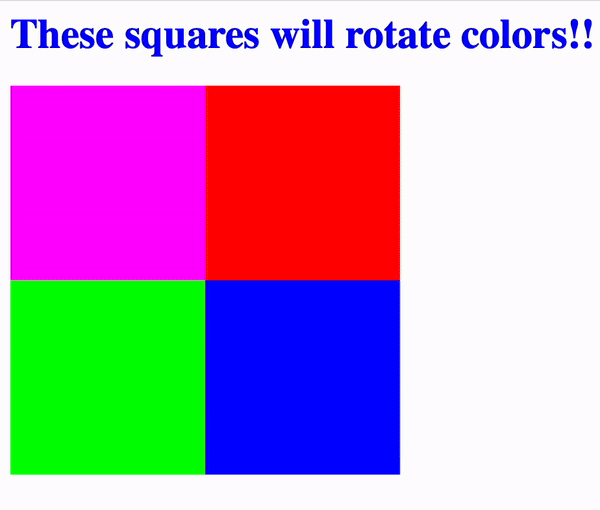

<!DOCTYPE html>
<html lang="en">
<head>
  <meta charset="UTF-8">
  <meta name="viewport" content="width=device-width, initial-scale=1.0">
</head>
<body style="font-family: Arial, sans-serif; line-height: 1.6; color: #000000; background-color: #F9F4F5;">

<h1 style="color: #502F4C; font-size: 2em;">HTML5RotatingSquares</h1>

<strong>HTML5RotatingSquares</strong> is a simple HTML5 project that displays four squares, each rotating through different colors. This project demonstrates the use of HTML5's Canvas object and Javascript for a visually dynamic effect.

<h2 style="color: #502F4C; font-size: 1.5em;">Demo</h2>

Demo GIF showcasing the rotating color effect.

<h2 style="color: #502F4C; font-size: 1.5em;">Features</h2>

<ul style="margin-top: 10px;">
  <li>Four squares that continuously rotate through 4 colors.</li>
  <li>Smooth color transitions for an eye-catching animation.</li>
  <li>Built using minimal HTML5 and Javascript</li>
</ul>

<h2 style="color: #502F4C; font-size: 1.5em;">Technologies Used</h2>

<ul style="margin-top: 10px;">
  <li>HTML5 for the webpage structure.</li>
  <li>Javascript for the animations and color transitions.</li>
</ul>

<h2 style="color: #502F4C; font-size: 1.5em;">Getting Started</h2>

<h3 style="color: #502F4C;">Prerequisites</h3>

All you need is a web browser to view the HTML page. No additional installations or dependencies are necessary.

<h3 style="color: #502F4C;">Installation</h3>

<ol>
  <li>Clone this repository to your local machine:
    <pre style="background-color: #C8B8DB; padding: 10px; border-radius: 5px; color: #000000;"><code>git clone https://github.com/RJPalmer/HTML5RotatingSquares.git</code></pre>
  </li>
  <li>Navigate to the project folder:
    <pre style="background-color: #C8B8DB; padding: 10px; border-radius: 5px; color: #000000;"><code>cd HTML5RotatingSquares</code></pre>
  </li>
  <li>Open the <code style="background-color: #C8B8DB; padding: 2px 4px; border-radius: 4px; color: #000000;">index.html</code> file in your preferred web browser.</li>
</ol>

<h2 style="color: #502F4C; font-size: 1.5em;">Usage</h2>

Simply open the HTML file to see the rotating squares in action. Customize the colors or timing in the CSS file if you want to personalize the effect.

<h2 style="color: #502F4C; font-size: 1.5em;">Code Overview</h2>

The main files in this project are:

<ul style="margin-top: 10px;">
  <li><code style="background-color: #C8B8DB; padding: 2px 4px; border-radius: 4px; color: #000000;">index.html</code> - Provides the basic structure of the page.</li>
  <li><code style="background-color: #C8B8DB; padding: 2px 4px; border-radius: 4px; color: #000000;">myScript.js</code> - Contains javascript functions that control the color rotation of each square.</li>
  <li><code style="background-color: #C8B8DB; padding: 2px 4px; border-radius: 4px; color: #000000;">Square.js</code> - Defines the Square object used in myScript.</li>
</ul>

<h2 style="color: #502F4C; font-size: 1.5em;">Contributing</h2>

To contribute, fork the repository, make changes, and submit a pull request.

<h2 style="color: #502F4C; font-size: 1.5em;">License</h2>

This project is open-source and available under the <a href="LICENSE" style="color: #70587C;">MIT License</a>.

</body>
</html>
